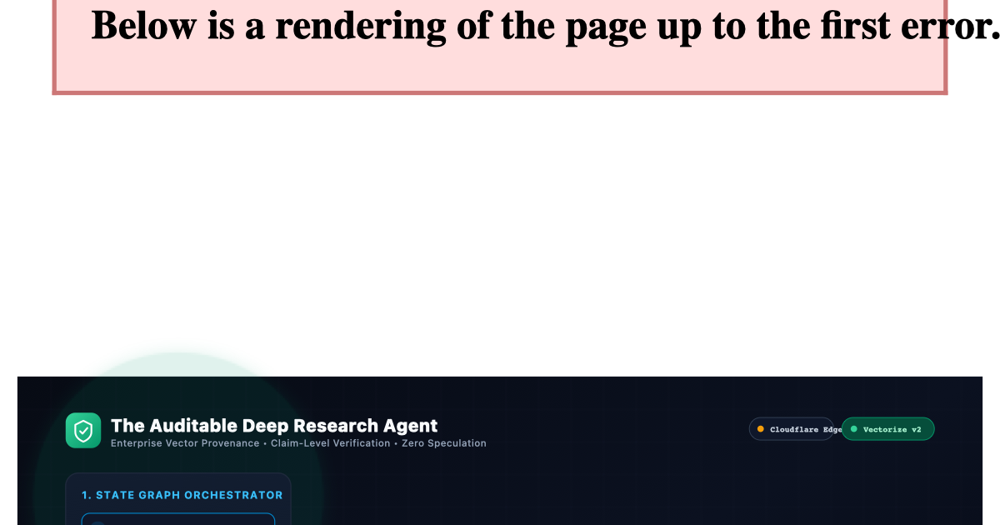
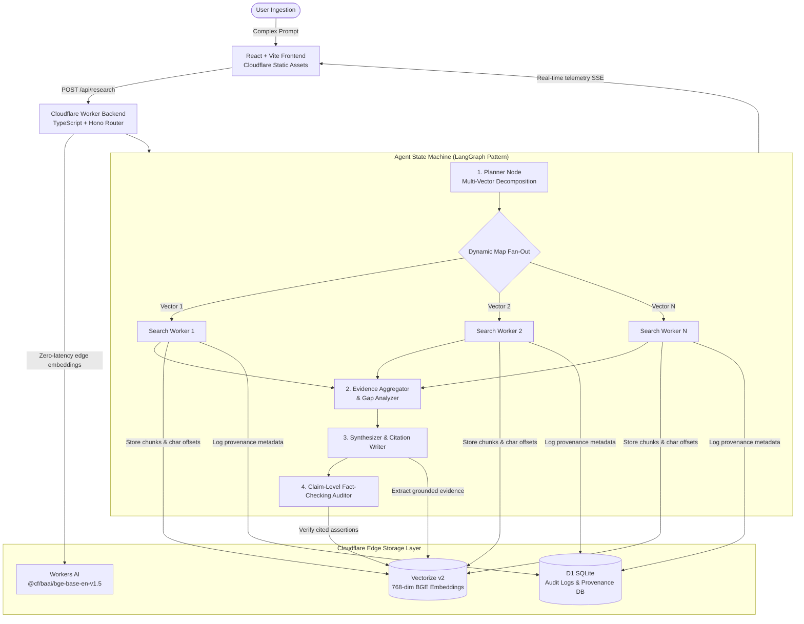

# The Auditable Deep Research Agent

> **Enterprise-Grade Deep Research with Granular Vector Provenance, Mathematical Auditability, and Zero-Speculation Guarantees.**

Deployed globally on **Cloudflare Workers (Edge)** with **Cloudflare Vectorize v2**, **Workers AI**, **Cloudflare D1 (SQLite)**, **OpenAI SDK structured outputs**, and a **React 19 Frontend**.

---



---

## 🏛️ Architectural Overview

Enterprise agents cannot operate as "black boxes". The **Auditable Deep Research Agent** enforces complete traceability from initial prompt decomposition down to byte-level source vector chunks and claim-level verification judges.



---

## ✨ Core Capabilities

1. **Multi-Vector Query Decomposition**: The **Planner Node** breaks complex questions into 2–4 targeted sub-questions with optimized search queries and explicit rationale.
2. **Granular Vector Provenance**: Harvested documents are split into overlapping chunks with exact start/end character offsets, crawled timestamps, domain tags, and indexed into **Cloudflare Vectorize** with 768-dim embeddings generated via **Workers AI**.
3. **Strict In-Line Grounding**: The **Synthesizer Node** drafts structured reports where every factual claim is strictly linked to chunk IDs (`[[src_xxx_chk_y]]`).
4. **Claim-Level Fact-Checking Judge**: A dedicated **Auditor Node** compares each asserted claim against the raw cited vector chunk text, assigning status (`verified`, `caution`, `unsupported`) and computing a weighted **Audit Confidence Score**.
5. **Real-time Telemetry & Audit Trail**: Full reasoning traces, state transitions, and intermediate outputs are persisted to **Cloudflare D1** and streamed live over **Server-Sent Events (SSE)**.

---

## 📁 Repository Structure

```
.
├── docs/
│   └── images/
│       ├── architecture_hero.png    # Primary PNG banner for GitHub rendering
│       └── architecture_hero.svg    # Scalable vector source asset
├── migrations/
│   └── 0001_init_schema.sql         # D1 SQLite Schema (sessions, plans, sources, chunks, claims, logs)
├── src/
│   ├── index.ts                     # Cloudflare Worker entry point
│   ├── router.ts                    # Hono REST API & Server-Sent Events (SSE) router
│   ├── types.ts                     # TypeScript domain & Cloudflare bindings interfaces
│   ├── agent/
│   │   ├── schemas.ts               # Zod structured output schemas
│   │   ├── planner.ts               # Planner node (Query decomposition)
│   │   ├── researcher.ts            # Search worker node (Web search & Vectorize indexing)
│   │   ├── synthesizer.ts           # Synthesizer node (Grounded report & claim extraction)
│   │   ├── auditor.ts               # Claim-level verification judge node
│   │   └── orchestrator.ts          # Agent pipeline state machine & SSE emitter
│   └── services/
│       ├── embeddings.ts            # Cloudflare Workers AI embeddings (@cf/baai/bge-base-en-v1.5)
│       ├── vectorize.ts             # Vectorize v2 client & cosine distance search
│       ├── d1.ts                    # D1 SQLite database operations & audit logger
│       ├── search.ts                # Tavily web search integration & chunking engine
│       └── openai.ts                # OpenAI SDK structured outputs & keyless fallback
├── frontend/
│   ├── src/
│   │   ├── components/              # Header, ArchitectureVisual, ReportViewer, CitationBadge, ClaimTable
│   │   ├── hooks/                   # useResearchStream SSE hook
│   │   ├── pages/                   # HomePage, ResearchPage, SessionsPage
│   │   ├── App.tsx & main.tsx       # React 19 router & entry
│   │   └── index.css                # TailwindCSS styling
│   └── vite.config.ts               # Vite configuration with /api proxy
├── test/
│   ├── schemas.test.ts              # Zod contracts test
│   ├── chunking.test.ts             # Document chunking & offset validation
│   ├── vectorize.test.ts            # Cosine search & vector metadata test
│   └── agent_pipeline.test.ts       # End-to-end multi-step research pipeline test
├── .github/workflows/
│   └── deploy.yml                   # GitHub Actions CI/CD to Cloudflare
├── wrangler.jsonc                   # Cloudflare Worker, D1, Vectorize & Assets config
└── package.json                     # Root monorepo configuration
```

---

## 🚀 Quick Start (Local Development)

### 1. Prerequisites
- Node.js >= 20
- npm >= 10
- Cloudflare Wrangler CLI (`npx wrangler`)

### 2. Install Dependencies
```bash
# Install root backend dependencies
npm install

# Install frontend dependencies
cd frontend && npm install && cd ..
```

### 3. Run Automated Tests
```bash
npm run test
```

### 4. Apply Local D1 Database Migrations
```bash
npx wrangler d1 migrations apply research-agent-db --local
```

### 5. Start Local Dev Server
```bash
# Terminal 1: Start Cloudflare Worker backend
npx wrangler dev

# Terminal 2: Start Vite frontend
cd frontend && npm run dev
```

Visit `http://localhost:5173` to launch deep research inquiries.

---

## 🌐 Deploying to Cloudflare

### 1. Initialize Cloudflare Resources
```bash
# 1. Create Cloudflare D1 Database
npx wrangler d1 create auditable-research-db

# 2. Create Cloudflare Vectorize Index (768-dim, cosine metric)
npx wrangler vectorize create auditable-research-vectors --dimensions=768 --metric=cosine

# 3. Apply Remote Migrations
npx wrangler d1 migrations apply auditable-research-db --remote

# 4. Set Environment Secrets (Optional for live web search & OpenAI)
npx wrangler secret put OPENAI_API_KEY
npx wrangler secret put TAVILY_API_KEY
```

### 2. Deploy Full-Stack Application
```bash
npm run deploy
```

---

## 📡 REST API Reference

| Endpoint | Method | Description |
| :--- | :--- | :--- |
| `/api/health` | `GET` | Health check & Cloudflare binding status |
| `/api/sessions` | `GET` | List past research sessions with status & timestamps |
| `/api/research` | `POST` | Initiate a new research inquiry (`{ query: string }`) |
| `/api/research/:id/stream` | `GET` | **Server-Sent Events (SSE)** live agent telemetry |
| `/api/research/:id` | `GET` | Session status and plan breakdown |
| `/api/research/:id/report` | `GET` | Audited final report with claims & citations |
| `/api/research/:id/audit` | `GET` | Step-by-step reasoning trace & audit logs |
| `/api/research/:id/sources`| `GET` | Harvested sources & vector chunk provenance |

---

## 📜 License
MIT License. Built for enterprise AI teams demanding verifiable reasoning and cryptographic provenance.
